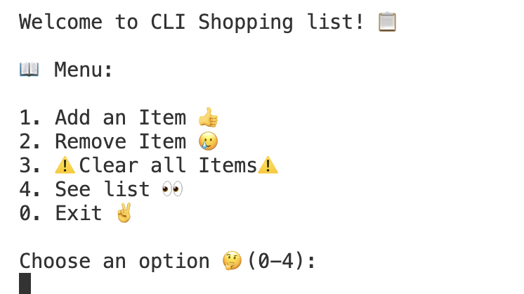

# cli-shopping-list

simple cli shopping list application! 

## Project Introduction

**What is this project?**

Quick project to be able to keep track of my shopping list while im working on my code.

You can add and remove items from your list one at a time, or clear the whole list.

You can see the list to check what you have added to it so you can see if you want to add more or less. 

**Why was it built?**

I often remember things I need to shop for while I'm working on my code, so I use code to be able to remember what I need to shop for!

**Who is it for?**

This is for the young, and somewhat forgetful working professional who want to keep up with their work and life at the same time.

## Deployment & Demo

**Live Deployment:** TBD

**Demo Recording:** TBD

**Project Screenshots:**

- 
  <!--   -  -->

<!-- ## Additional Project Links

- **Wireframes:** [Link to wireframe designs]
- **ERD (Entity Relationship Diagram):** [Link to database schema/ERD]
- **Project Proposal:** [Link to proposal document]
- **Project Blog:** [Link to development blog/journal]
- **Additional Resources:** [Any other relevant links] -->

## Tech Stack


**Additional Libraries & APIs:**

-[`prompt-sync`](https://www.npmjs.com/package/prompt-sync?activeTab=readme)

**Development Tools:**

- [`nodemon`](https://www.npmjs.com/package/nodemon)

```bash
# to run in development mode using nodemon
npm run dev
```

### Prerequisites

- Node.js v14+

### Installation Steps

1. **Clone the repository:**

   ```bash
   git clone [git@github.com:Gonzalomarcylabschool/cli-shopping-list.git]
   cd [cli-shopping-list]
   ```

1. **Install dependencies:**

   ```bash
   npm install
   ```

1. **Start the application:**

   ```bash
   # start command
   npm start
   ```

1. **Access the application:**
   - Application will run in the terminal

## Contributing (Optional)

We welcome contributions to this project! Please follow these guidelines:

### How to Contribute

1. **Fork the repository**
2. **Create a feature branch:** `git checkout -b feature/your-feature-name`
3. **Make your changes** following our coding standards
4. **Write or update tests** as needed
5. **Commit your changes** with descriptive commit messages
6. **Push to your branch:** `git push origin feature/your-feature-name`
7. **Submit a pull request** with a clear description of your changes

### Contribution Guidelines

- Follow the existing code style and conventions
- Write clear, descriptive commit messages
- Include tests for new functionality
- Update documentation as needed
- Ensure all tests pass before submitting PR

---

## Development Workflow

This project follows a **branch and merge workflow**:

- **Never push code directly to the main branch**
- Work on separate feature branches
- Create pull requests (PRs) for all changes
- **All PRs must be reviewed and merged by someone else, even on solo projects**
- Delete branches after successful merges

### Branch Naming Convention
- `feature/feature-name` for new features
- `fix/bug-description` for bug fixes
- `update/component-name` for updates
- `style/styling-changes` for styling updates

## Documentation Standards

### Inline Comments
- Document your code with clear, concise comments
- Label different parts of the code
- Describe what functions and files are for
- **Delete any commented-out code** before committing

### Commit Message Format
Use descriptive commit messages that start with:
- `feat:` for new features
- `fix:` for bug fixes
- `update:` for updates to existing functionality
- `style:` for styling changes
- `delete:` for removing code/files

**Examples:**
```
feat: add user authentication system
fix: resolve login validation bug
update: improve error handling in API calls
style: update navigation bar styling
delete: remove deprecated helper functions
```

### Pull Request Guidelines

**All PRs should include:**
- **Descriptive titles** that summarize the changes
- **Detailed descriptions** including:
  - Features added or modified
  - Bug fixes implemented
  - Successful testing results
  - Any breaking changes
  - Screenshots (if UI changes)

**PR Description Template:**

```markdown
## What this PR does
[Brief description of changes]

## Features Added/Modified
- [List of new features or modifications]

## Testing
- [X] All tests pass
- [X] Manually tested functionality
- [X] No breaking changes

```

---

## License

[Add license information if applicable]

## Contact

Email: gonzalo@marcylabschool.org

---

*This README follows best practices for project documentation and workflow management.*